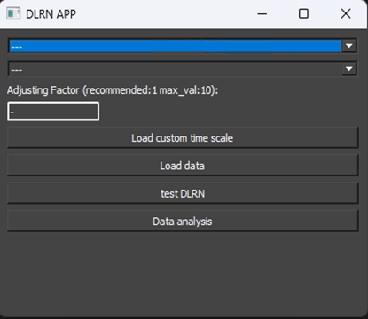
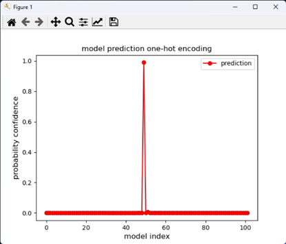
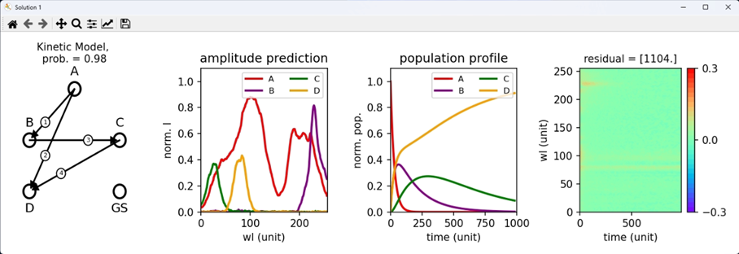
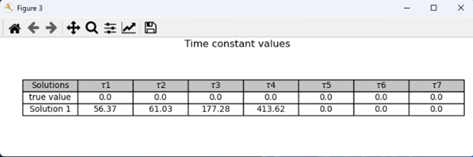

# DLRN_App

The Deep Learning Reaction Network (DLRN) App is a user-friendly graphical interface that can be used to analyze
time-resolved spectroscopy and agarose gel data sets.

# Requirements

DLRN app was created using:

     python == 3.10.9
     TensorFlow == 2.10 (Native Windows)
     pyqt5
     scikit-image
     matplotlib
     numpy
     
# Protocol

To use DLRN app, please follow this  protocol.

1)start with downloading all the files in the repository. It can take a few minutes for the Large files.

2)unzip the pre-trained model files

3)start the GUI using the command "python3 DLRN_GUI.py" in the prompt or using VScode.

After these three steps, a Graphic window will open and a few options can be selected:

1.	Select Spectra or Agarose Gel from the first set of options. This will load the pre-trained DLRN model for the respective scenario. This can take a few minutes.
2.	 Select Top 1 or Top 3 from the second set of options. This will change the analysis output, giving the solution for either the most probable output or the three most probable outputs.
3.	Select the scale factor (suggested value = 1). This rescales the timescale to let DLRN analyze data sets with a time window larger than one timescale. However, using a large value for the scale factor can change the     
    results of the analysis due to data interpolation during preprocessing data preparation.
4.	Load the timescale to be used for the measurements. It is important to rescale the data with one that matches the timescale used during the DLRN analysis. 
5.	Load the data to be analyzed using “load the data” (located at the bottom). Search for the data that you want to analyze using the browser window. Only a NumPy zip file (.npz) having a subfolder “train” or .txt/.dat 
    files can be loaded in the GUI.
6.	(Optional) Is it possible to test the DLRN performance using the “Test DLRN” button. This allows the user to try a few ground truth data to check the performance. 
7.	Click the “Data Analysis” button to start the analysis and obtain the DLRN analysis results. This can be done only after the compulsory steps (1–5) have been completed.

After clicking Data Analysis, new windows will be open. These new windows will show the DLRN solutions. Below is an example of when Top1 is selected. If Top3 is selected instead, Three solutions will be open.

One-hot encoding solution from DLRN. it gives you an idea of the confidence of the output.

Model (with probability confidence), amplitude, population profile, and residuals obtained by DLRN analysis.

Table of the kinetic time constants constant for each prediction. 

# Collaboration

This work is a collaboration partnership with the group of Prof. Dr. Susanne Gerber, Uni Medical Center, Mainz. https://csg.uni-mainz.de/group-member/susanne-gerber/

## Credit and Licence

This code is provided by Dr. Nicolo Alagna and the Computational Systems Genetics Group of the University Medical Center of Mainz. © 2024 All rights reserved.
